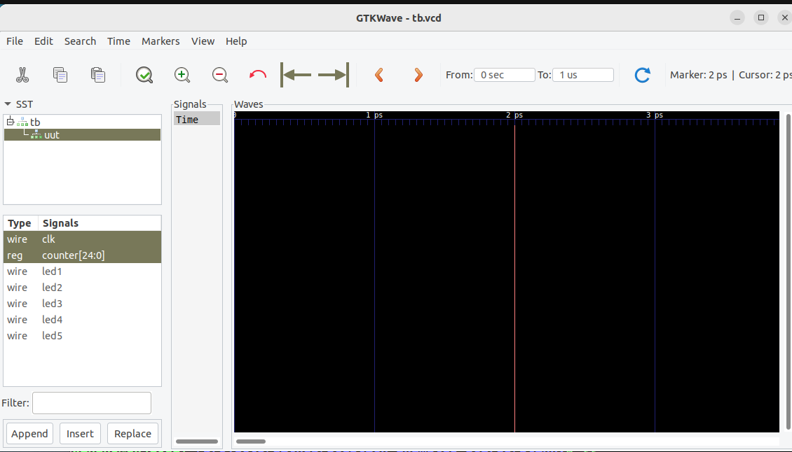
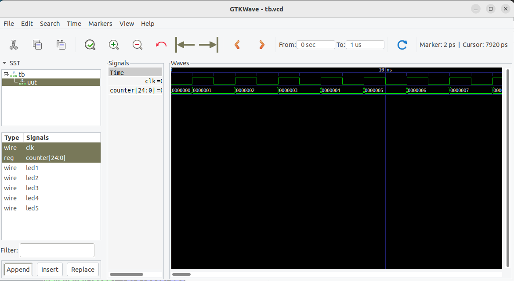

# Apps for Discussing Verilog and ICE40 FPGAs

The latest ICE40 FPGA docs can be found here: https://www.latticesemi.com/Products/FPGAandCPLD/iCE40

# Get The FOSS Toolchain

These instructions have been verified on:
- Ubuntu 22.04.2 LTS on 2023-06-24
- Ubuntu 20.04.2 LTS on 2023-06-24
- 64-bit Raspbian Debian GNU/Linux 11 (bullseye) on 2023-06-25 (See https://github.com/johnwinans/raspberry-pi-install for details on how I set up mine.)


## Install from packages (where available)

On Ubuntu 22.04.2 LTS and on a Raspberry PI running 64-bit Debian GNU/Linux 11 (bullseye), I was able to install the required tools like this:

```
sudo apt install iverilog
sudo apt install gtkwave
sudo apt install fpga-icestorm
sudo apt install yosys
sudo apt install nextpnr-ice40
sudo apt install flashrom
```

Note that, on older systems, packages for these tools can be outdated or missing.

## Install from source

On Ubuntu 20.04.2 LTS I was able to build the toolchain and install it under `/usr/local` like this:

```
sudo apt install iverilog
sudo apt install gtkwave
sudo apt install build-essential libftdi-dev libboost-all-dev libeigen3-dev clang-format python3-dev cmake

nproc=3

git clone https://github.com/YosysHQ/icestorm.git
cd icestorm
    make -j$(nproc)
    sudo make install
cd ..

git clone https://github.com/YosysHQ/nextpnr
cd nextpnr
    cmake . -DARCH=ice40
    make -j$(nproc)
    sudo make install
cd ..

git clone https://github.com/YosysHQ/yosys.git
cd yosys
    make -j$(nproc)
    sudo make install
cd ..
```

# Configure for your FPGA board

By default, this repo is configured to build for the [upduino-v3-1](https://tinyvision.ai/products/upduino-v3-1).
If you are using a different board then you must create a configuration to suit your needs.

NOTE: The blinky example programs use an oscillator to automatically count and flash LEDs.  The UPduino comes with an oscillator, but it is disconnected.  Therefore, out of the box, `blinky` and `blinky2` will not appear to do much unless you connect the oscillator yourself.  [This page discusses the details](https://upduino.readthedocs.io/en/latest/tutorials/oscillator.html) of connecting the oscillator using a solder jumper.  Another, perhaps easier, solution would be to install the header pins that the UPduino comes with, install it into a breadboard and then connect a jumper from the pins labeled `20` and `12M` (which are on header pins 44 and 41 respectively.)  Before doing so, however, also read the [UPduino errata](https://upduino.readthedocs.io/en/latest/features/specs.html#errata) where they mention that the silkscreen is wrong on some versions of the board.  Luckily, it is correct on version 3.1.  So if you got yours in/after 2023, maybe it is OK!

WARNING: These applications are intended to flash the LEDs on various FPGA boards.  The UPduino board appears to lack proper current limiting resistors! Therefore, running these apps on the UPduino with the LEDs on more than a a few seconds could destroy it!  (I ran it on mine for a good 10 minutes before realizing and it survived fine.  But I don't recommend it.)

If you are using an [IceStick](https://www.latticesemi.com/icestick) then create a file named `Make.local` in
the top REPO directory and insert the following line into it:

```
include $(TOP)/Make.icestick.rules
```

If you are using a [2057-ICE40HX4K-TQ144-breakout](https://github.com/johnwinans/2057-ICE40HX4K-TQ144-breakout) then
then create a file named `Make.local` in the top REPO directory and insert the following line into it:

```
include $(TOP)/Make.2057.rules
```

To explicitly configure for the upduino-v3-1 you can create a file named `Make.local` in the top REPO directory and insert the following line into it:

```
include $(TOP)/Make.upduino.rules
```

If you decide to create a configuration for another board, please share it with the commulity by 
submitting a pull request, creating an issue, etc.


# To compile applications

You can compile/clean all the projects in this REPO from the top level directory
using `make` and `make clean`.  If you want to only build one then go into its
directory and `make`, `make clean` from there.

# To simulate an application and view a waveform of it running 

```
cd blinky2
make plot
```

Then, in gtkwave, open (double-click) the 'tb' object in the tree, click on 'uut'. 




Then, in the signals box below click on the 'clk' signal and ctrl-click on 'counter[24:0]'
(so that they are both selected at the same time) and click the Append button at the 
bottom left.  

At this point, you can zoom and scroll around the waveform on the right to see the 
clock signal ticking and the counter advancing on the rising/positive edge of 
the 'clk' signal.


