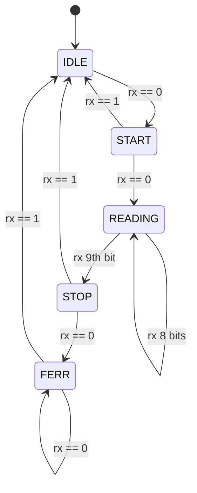

# A UART

## `uart_tx` 
- `uart_tx` is a module implemented using a priority-encoder style state machine.
- All interface signals are synchronized to the rising edge of the `clk` port.
- A bit-rate clock must be delivered on the `brg16_tick` port as a 16X bit-rate periodic tick signal in the `clk` domain.
- To transmit a byte, place the data on the `d` port and assert `d_tick` any time that the `tx_empty` signal is high.
- The `tx_done_tick` signal is true during the first `clk` period any time that `tx_empty` goes high.

There is no FIFO nor holding register per-se.  The `tx_empty` is true when the transmitter shift-register becomes empty/idle
at the begining of the stop-bit period.

## `uart_rx`

- `uart_rx` is a module implemented using a one-hot style state machine.

